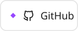

<a href="https://charleslacantara.com">
  <picture>
    <source media="(prefers-color-scheme: dark)" srcset="./assets/hero-dark.svg">
    <source media="(prefers-color-scheme: light)" srcset="./assets/hero-light.svg">
    
  </picture>
</a>

  <a href="https://charleslacantara.com"><picture><source media="(prefers-color-scheme: dark)" srcset="./assets/chip-site-dark.svg"></picture></a>
  <a href="mailto:charles.a7cantara@gmail.com"><picture><source media="(prefers-color-scheme: dark)" srcset="./assets/chip-email-dark.svg"></picture></a>
  <a href="https://linkedin.com/in/charles-alcantara"><picture><source media="(prefers-color-scheme: dark)" srcset="./assets/chip-linkedin-dark.svg"></picture></a>
  <a href="https://github.com/selrvk"><picture><source media="(prefers-color-scheme: dark)" srcset="./assets/chip-github-dark.svg"></picture></a>

 

 

### Tools I work with

<table>
  <tr>
    <td><b>Frontend</b></td>
    <td><picture><source media="(prefers-color-scheme: dark)" srcset="https://skillicons.dev/icons?i=react,nextjs,ts,angular,vue,svelte,tailwind,bootstrap&theme=dark"></picture></td>
  </tr>
  <tr>
    <td><b>Backend</b></td>
    <td><picture><source media="(prefers-color-scheme: dark)" srcset="https://skillicons.dev/icons?i=nodejs,express,fastapi,django,spring,php&theme=dark"></picture></td>
  </tr>
  <tr>
    <td><b>Languages</b></td>
    <td><picture><source media="(prefers-color-scheme: dark)" srcset="https://skillicons.dev/icons?i=js,py,java,kotlin,swift,dart,c,cpp&theme=dark"></picture></td>
  </tr>
  <tr>
    <td><b>Data and AI</b></td>
    <td><picture><source media="(prefers-color-scheme: dark)" srcset="https://skillicons.dev/icons?i=pytorch,tensorflow,postgres,mongodb,mysql,firebase,sqlite&theme=dark"></picture></td>
  </tr>
  <tr>
    <td><b>Design and ops</b></td>
    <td><picture><source media="(prefers-color-scheme: dark)" srcset="https://skillicons.dev/icons?i=figma,xd,ps,ai,docker,git,linux,jenkins&theme=dark"></picture></td>
  </tr>
</table>

### A year of commits, in 3D

<picture>
  <source media="(prefers-color-scheme: dark)" srcset="./profile-3d-contrib/skyline-dark.svg">
  
</picture>

<picture>
  <source media="(prefers-color-scheme: dark)" srcset="./dist/snake-dark.svg">
  
</picture>

 

Every graphic here is a hand-built SVG in <a href="./assets">/assets</a>, generated by <a href="./scripts/build.py">scripts/build.py</a>. The skyline and snake redraw themselves daily.
&nbsp;

